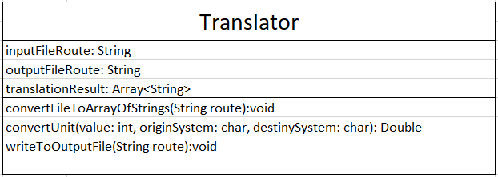

# UniversalTranslator
With this program you can convert values from one temperature system to another, it can convert from Celsius, Kelvin and Fahrenheit degrees to another.

The Runtime of this program is **Node.js**


The file format it recives as input is of **.txt** extension, in which every value is separated by commas. 
The strict order in which you have to send the data is: *value,currentUnit,destinyUnit* you can't put spaces between the values.

The temperature system that you specifies is defined by the initial letter in uppercase. For example: C(For Celsius), F(For Fahrenheit) and K(For Kelvin).

If you want to learn more about the license.md [click here](./LICENSE)


-Example of the content in input.txt:
```
105,C,K
68,C,F
90,F,C
100,K,F
```

**UML Class of the project**




